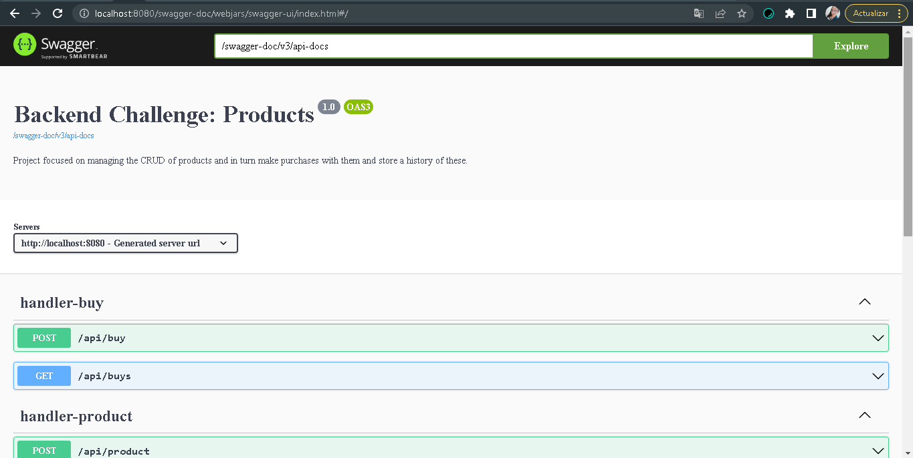
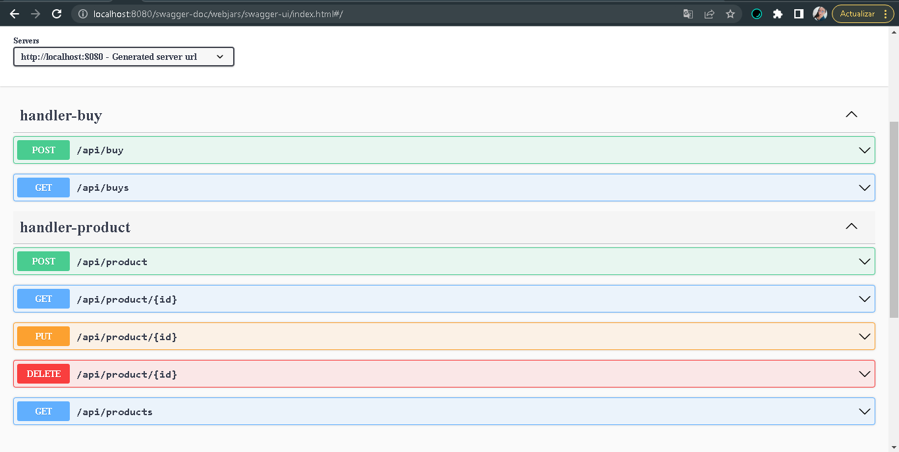
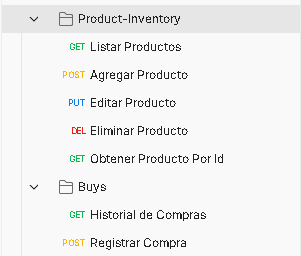

# Reto Backend Proyecto de Productos

## Ejecución

Para correr el proyecto se debera tener instalado gradle y java (preferiblemente Java 11), despues ejecutar el siguiente comando en la consola:
### gradle app-service:bootRun

A continuación se podran probar las diferentes peticiones utilizando alguno de los siguientes metodos:

## Documentación con Swagger

En el siguiente enlace se tendra acceso a las diferentes peticiones del presente proyecto:
http://localhost:8080/swagger-doc/webjars/swagger-ui/index.html#/

En esta Url nos aparecera la siguiente interfaz:

Y en esta interfaz podremos tener acceso a las diferentes peticiones como se muestra acontinuación:

## Postman

Para realizar las respectivas pruebas de las peticiones del proyecto se podra utilizar Postman ejecutando las siguientes peticiones:

De igual manera en la raiz del proyecto se encontrara un archivo .json de la respectiva colección nombrada de la siguiente manera:

"RetoBackend-Products.postman_collection.json".

## Evidencia Coverage

Se realizaron pruebas unitarias sobre los casos de uso obteniendo como resultado el siguiente coverage:

